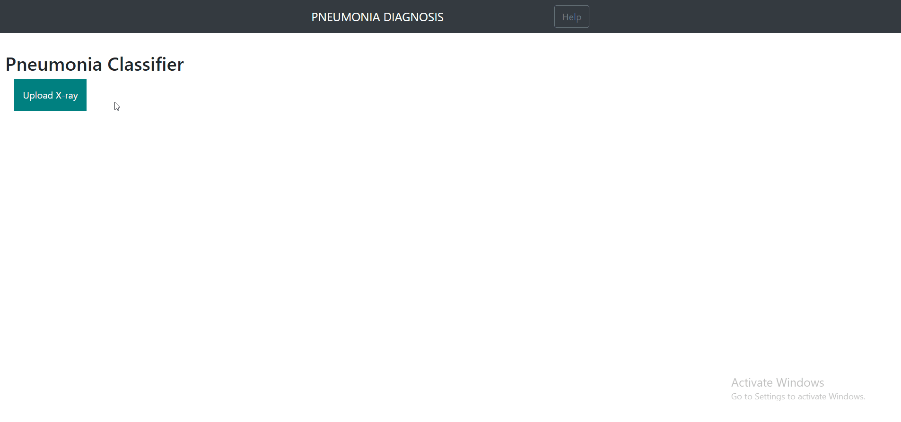

# Pneumonia Classifier
A CNN model that diagnoses Chest X-rays (CXR) as Pneumonic or Normal. This repository contains model building notebooks.
Deployment in **HEROKU**                                                                                                                   
**LINK:** https://pneumonia-diagnosis-prototype.herokuapp.com/  
**WORKING SAMPLE:**

